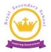

<a name="readme-top"></a>

<div align="center">

  
  <br/>

  <h3><b>CAPSTONE PROJECT 1</b></h3>

</div>

# 📗 Table of Contents

- [📖 About the Project](#about-project)
  - [🛠 Built With](#built-with)
    - [Tech Stack](#tech-stack)
    - [Key Features](#key-features)
  - [🚀 Live Demo](#live-demo)
- [💻 Getting Started](#getting-started)
  - [Setup](#setup)
  - [Prerequisites](#prerequisites)
  - [Install](#install)
  - [Usage](#usage)
  - [Run tests](#run-tests)
  - [Deployment](#triangular_flag_on_post-deployment)
- [👥 Authors](#authors)
- [🔭 Future Features](#future-features)
- [🤝 Contributing](#contributing)
- [⭐️ Show your support](#support)
- [🙏 Acknowledgements](#acknowledgements)
- [❓ FAQ (OPTIONAL)](#faq)
- [📝 License](#license)


# 📖 Capstone Project 1 <a name="about-project"></a>


**Capstone Project 1** is a solo project done in week 5 of module 1. Built using the Cindy Chen design for Royal Primary & Secondary School

## 🛠 Built With <a name="built-with"></a>

<details>
  <summary>Markup Language</summary>
  <ul>
    <li><a href="https://html.com/">HTML</a></li>
  </ul>
</details>

<details>
  <summary>Styling Language</summary>
  <ul>
    <li><a href="https://web.dev/learn/css/">CSS</a></li>
  </ul>
</details>

<details>
  <summary>Script Language</summary>
  <ul>
    <li><a href="https://www.javascript.com">Javascript</a></li>
  </ul>
</details>

### Key Features <a name="key-features"></a>

- **Built for both Mobile & Desktop**
- **Displays the Home & About Page**
- **Teachers section built dynamically using Javascript**

<p align="right">(<a href="#readme-top">back to top</a>)</p>

## 🚀 Live Demo <a name="live-demo"></a>


- [Live Demo Link](https://sunga12.github.io/Capstone-project-1/)

- [Video Presentation]()

<p align="right">(<a href="#readme-top">back to top</a>)</p>


## 💻 Getting Started <a name="getting-started"></a>

To get a local copy up and running, follow these steps: Clone Github Repo using SSH, HTTP, or via Github Desktop.

### Prerequisites

In order to run this project you need: 

- Microsoft Visual Studio Code
- A Github account
- Internet Connection.

```sh
  cd your-project
  npm init -y  
  npm install --save-dev hint@7.x
  npm install --save-dev stylelint@13.x stylelint-scss@3.x stylelint-config-standard@21.x stylelint-csstree-validator@1.x
```

### Setup

Clone this repository to your desired folder:

```sh
  cd your-folder
  git@github.com:sunga12/Capstone-project-1.git
```

### Install

Install this project with:


### Usage

To run the project, execute the following command:


### Run tests

To run tests, run the following command:

```sh
  npx hint .

  npx stylelint "**/*.{css,scss}"

  npx eslint .
```

### Deployment

You can deploy this project using: Github Pages


<p align="right">(<a href="#readme-top">back to top</a>)</p>


## 👥 Authors <a name="authors"></a>

👤 **Sungabanja Thawethe**

- GitHub: [@sunga12](https://github.com/sunga12)
- Twitter: [@OfficialAseT](https://twitter.com/OfficialAseT)
- LinkedIn: [Sungabanja Thawethe](https://www.linkedin.com/in/sungabanja-thawethe-b3419b142/)

<p align="right">(<a href="#readme-top">back to top</a>)</p>


## 🔭 Future Features <a name="future-features"></a>

- [ ] **Application Form Page**
- [ ] **School News Page**
- [ ] **Presentation**

<p align="right">(<a href="#readme-top">back to top</a>)</p>

## ⭐️ Show your support <a name="support"></a>

If you like this project follow me on GitHub!

<p align="right">(<a href="#readme-top">back to top</a>)</p>

## 🙏 Acknowledgments <a name="acknowledgements"></a>

I would like to thank Microverse for this opportunity to become a software developer.

<p align="right">(<a href="#readme-top">back to top</a>)</p>

## 📝 License <a name="license"></a>

This project is [MIT](./LICENSE) licensed.

Cindy Shin on Behance: (https://www.behance.net/gallery/29845175/CC-Global-Summit-2015)

<p align="right">(<a href="#readme-top">back to top</a>)</p>